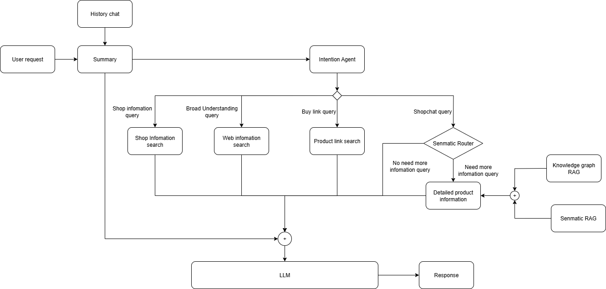
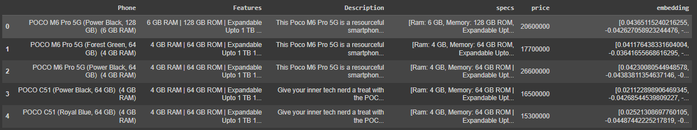
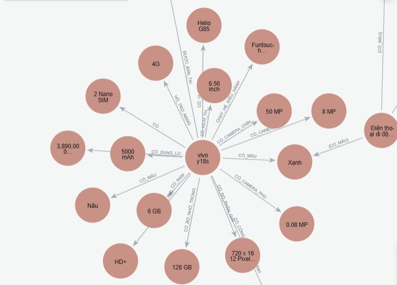
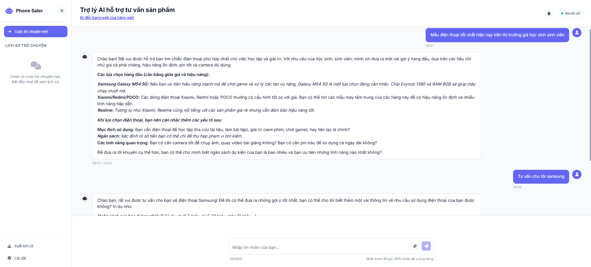

# Phone Sale Assistant Chatbot

- Github: [ktoan911](https://github.com/ktoan911)
- Email: khanhtoan.forwork@gmail.com


This chatbot supports phone marketing, is a combination of the most advanced RAG technologies, including **Agentic RAG**, **Graph RAG**, and **Semantic RAG**, integrated in a way that ensures optimal query time and result delivery. The architecture creates a more powerful model by providing additional information from database retrieval to the model.


## System Architecture Image



## I. Setting Up the Backend Environment
#### Step 1: Create a Conda environment named your_env_name with Python 3.11.3

```python
conda create -n ${your_env_name} python= 3.11.3
conda activate ${your_env_name}
```

#### Step 2: Install the packages from the requirements.txt file

```
cd backend
pip install -r requirements.txt
```

#### Step 3: Create a .env file and add the following lines, replacing the placeholders with your actual values:
```env
# API Keys
OPENAI_API_KEY=your_openai_api_key_here
GOOGLE_API_KEY=your_google_api_key_here

# Database
MONGODB_URI=mongodb://localhost:27017/chatbot_db
NEO4J_URI=bolt://localhost:7687
NEO4J_USER=neo4j
NEO4J_PASSWORD=your_password

# Application
FLASK_ENV=development
FLASK_DEBUG=True
API_HOST=0.0.0.0
API_PORT=5000

```
## II. Data

For this project, we use data following the format below:


- The data set we use includes 320 phone models containing price information and detailed phone descriptions.
- We are using MongoDB Atlas for Vector Search. You can learn how it works and how to do it [here](https://www.mongodb.com/docs/atlas/atlas-vector-search/vector-search-overview/#atlas-vector-search-queries).

From the collected data above, we construct a graph consisting of entities represented by the nouns that appear, and the relationships between those entities. For example:


## III. Basis and method of evaluation RAG
We use a combination of **Agentic RAG**, **GraphRAG**, and **Semantic RAG** technologies to retrieve additional information based on the user's query. This combination still ensures stable performance by using multi-threading for processing, combined with **Cypher query** to accelerate graph retrieval.

We use the [RAGAS](https://docs.ragas.io/en/stable/) library and a test dataset following the template below to evaluate three properties of RAG, including **Faithfulness**, **Answer Relevance**, and **Context Relevance**.

Example of test dataset:
```
  {
    "question": <User query>,
    "ground_truth": <True response>,
    "context": <RAG infomation>,
    "answer": <LLM Respone after RAG>
  },
```

Result:
```
  {
    "Faithfulness": 0.91,
    "Answer Relevance": 0.88,
    "Context Relevance": 0.4,
  },
```

## IV. Demo and Appplication

The interface of the application:


